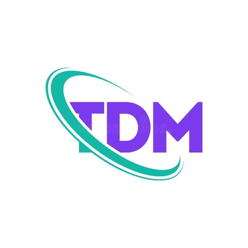
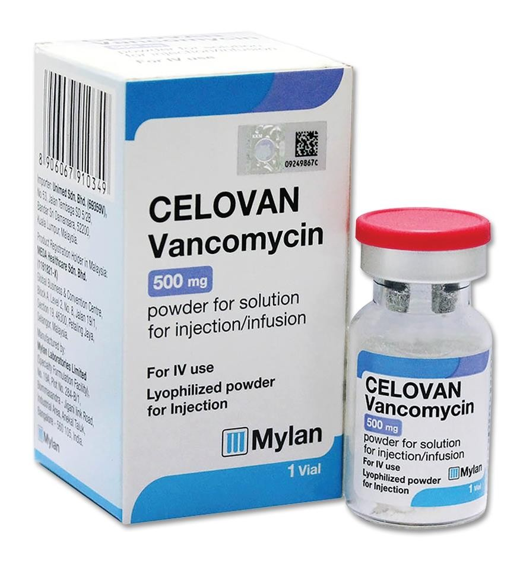

# TDM Insight: Vancomycin TDM Calculator ⚗️



**TDM Insight** is a professional, native Android clinical tool designed to assist healthcare professionals and students in performing **Vancomycin Therapeutic Drug Monitoring (TDM)**. By leveraging modern pharmacokinetic models, the app ensures therapeutic efficacy while minimizing the risk of nephrotoxicity.

Developed for the **Mobile Application Development (CDE2313)** course at Albukhary International University.

---

## 📽️ Demo & Screenshots

> [!TIP]
> **Video Demonstration**: [View the full App Demo on Google Drive](PASTE_YOUR_DRIVE_LINK_HERE)

| Welcome Screen | Clinical Input | Interactive Graph |
| :---: | :---: | :---: |
|  | *Professional Form* | *Dynamic Simulation* |

---

## 🚀 Key Clinical Features

- **Dynamic Clinical Workflows**: Forms automatically adapt based on your selection (**Pre**, **Post**, or **Pre + Post**).
- **Interactive PK Simulation**: A live Canvas-based graph that redraws in real-time as you adjust Dose, Interval, or Infusion time.
- **Therapeutic Target Windows**: The graph features **Green (Trough)** and **Yellow (Peak)** bands to visually guide the clinician.
- **Professional Math Explanation**: Every result includes a step-by-step mathematical breakdown.
- **Smart Validation System**: Red asterisk (*) requirement system and clinical range placeholders.
- **Clinical Reporting**: Generate professional A4 clinical PDF reports and share them instantly.
- **CameraX Integration**: Capture and attach fictional lab reports directly to the patient case.

---

## 📂 Project Structure & Page Map

The app features a clean 9-page architecture designed for clinical efficiency:

1.  **Splash Screen** (3.5s Clinical Animation)
2.  **Welcome Screen** (Overview & Branding)
3.  **Workflow Selection** (Pre, Post, or Pre+Post selection)
4.  **Patient Case Entry** (Age, Weight, Height, SCr collection)
5.  **Camera Preview** (Lab report capture)
6.  **Therapy Input Form** (Dynamic clinical parameters)
7.  **Review Inputs** (Summary & final validation check)
8.  **Calculation Results** (PK outputs & Dynamic Graph)
9.  **Math Explanation** (Formula breakdowns)

---

## 👨‍💻 Team AIU Task Division

Our team meticulously divided the responsibilities to ensure the highest clinical and technical standards.

| Developer | Responsibilities & Ownership |
| :--- | :--- |
| **Yalda Ashrafi** | **Project Lead & Engine Architect**: Core Calculation Engine (VancomycinEngine, PK Formulas), Input Validator logic, Navigation (AppNavigation, MainActivity), UI Theme & Color architecture, Splash/Workflow/Review/About screens, and all primary clinical documentation (Case Study, Formulas, Team Contribution). |
| **Benat Siraj** | **Visualization & Logic Lead**: Custom Canvas Graphing (ConcentrationGraph), PDF Export System (SummaryExporter), History Feature, CameraX Integration, Patient Case Entry Screen, and project maintenance (README, CHANGELOG, AI folder). |
| **Mohammad Elyas Yameen** | **Components & UI/UX Lead**: Reusable Form Components, Therapy Input Form, Results Screen, Explanation Screen (Step-by-step math UI), Resource Management (Values, Drawables), Wireframes, and high-fidelity screenshots for project documentation. |

---

## 🛠️ Installation Guide

Follow these steps to set up and run the project locally from the **main** branch:

1.  **Clone the repository**:
    ```bash
    git clone -b main https://github.com/Yalda-Ashrafi/tdm-insight-android.git
    ```
2.  **Open the project** in Android Studio (latest stable release recommended).
3.  **Let Gradle sync** complete.
4.  **Connect a device** or start an emulator (Minimum API level 26).
5.  **Click Run ▶** to launch the application.

---

## 🛠️ Technical Stack
- **Language**: Kotlin
- **UI**: Jetpack Compose (Material 3)
- **APIs**: CameraX, PdfDocument API, Coil 3
- **Architecture**: MVVM (Model-View-ViewModel)

---

## ⚖️ Clinical Disclaimer
*This is an academic prototype for educational purposes only. It is not intended for real-world clinical decision-making. All demonstration data is fictional.*

**Instructor**: Ts. Mohd Zulkifli Mohd Zaki  
**Albukhary International University (AIU)**
