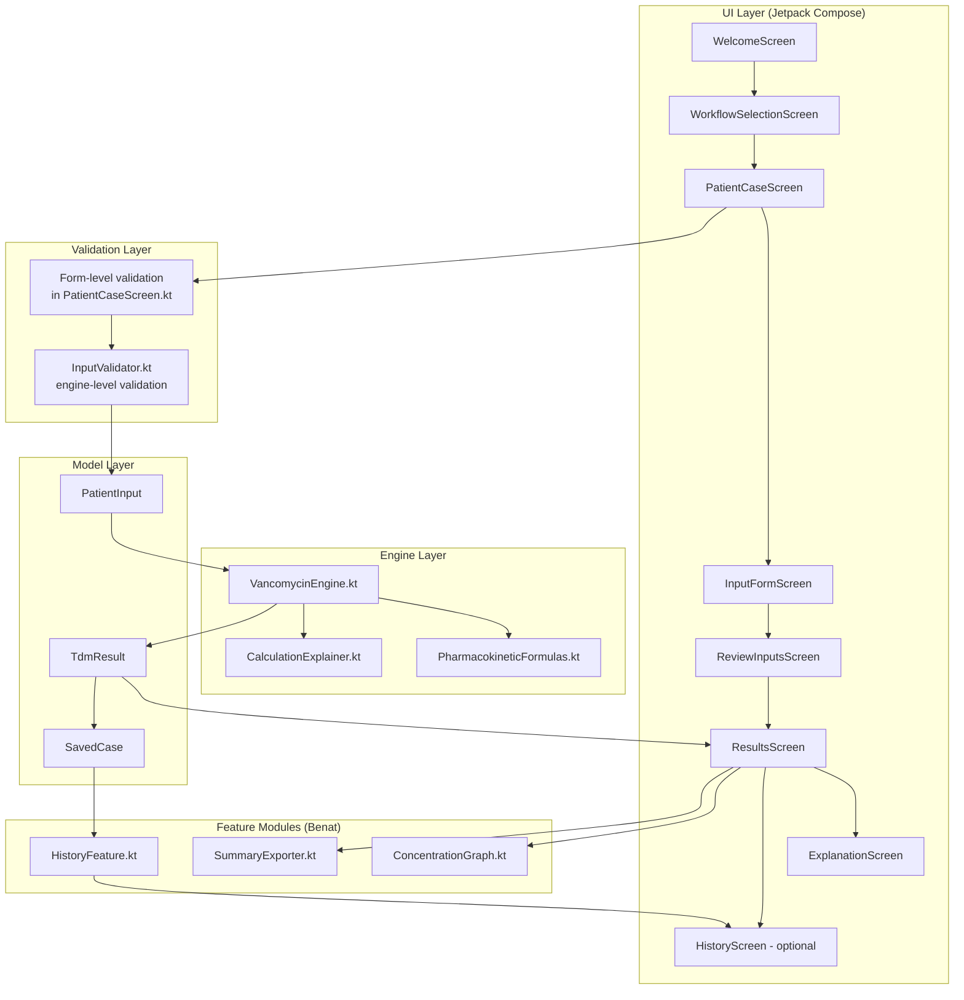

# Architecture Diagram

**Owner:** Benat

This diagram shows how TDM Insight's main packages relate to each other:
the UI layer (Compose screens) sends validated patient data to the
engine layer, which returns a result that flows back up to be displayed,
saved, and optionally exported.

## Notes

- The **UI Layer** follows the 9-screen flow defined in the project's
  screen plan; each screen is a separate Composable function.
- **Validation** happens twice: a fast, UI-facing pass on the screen
  itself (immediate feedback), and a deeper pass in `InputValidator.kt`
  before data reaches the engine (safety net).
- The **Engine Layer** is intentionally isolated from the UI — it takes
  a `PatientInput` and returns a `TdmResult`, with no knowledge of
  Compose or navigation.
- **Feature modules** (`ConcentrationGraph`, `HistoryFeature`,
  `SummaryExporter`) are display/utility components that consume the
  engine's output but do not perform calculations themselves.