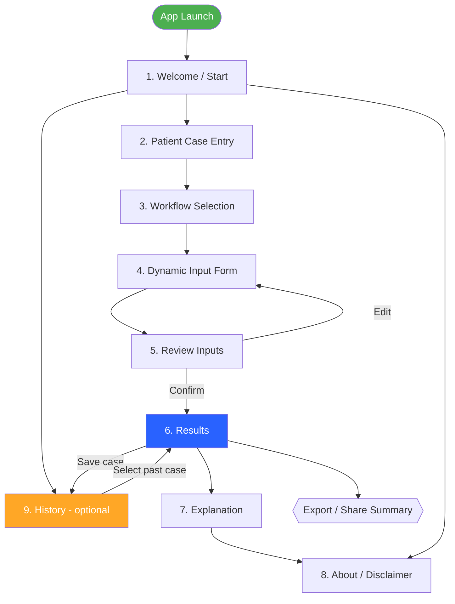

# Screen Flow Diagram

**Owner:** Benat

This diagram shows the navigation flow between all 9 screens of TDM
Insight, including the optional History screen and the branch back to
patient entry for a new case.

## Notes

- Screens 1–8 are mandatory per the project's screen plan; Screen 9
  (History) is optional.
- The **Review Inputs** screen allows looping back to the **Dynamic
  Input Form** if the user needs to correct something before
  calculation.
- From **Results**, the user can either view the **Explanation**
  (reasoning/formulas behind the recommendation), **export/share** the
  summary, or **save the case** to History for later review.
- **About / Disclaimer** is reachable from the Welcome screen at any
  time, independent of an active case.